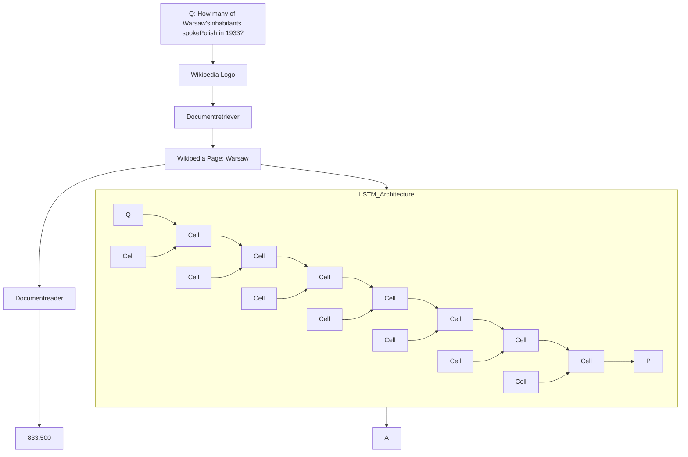
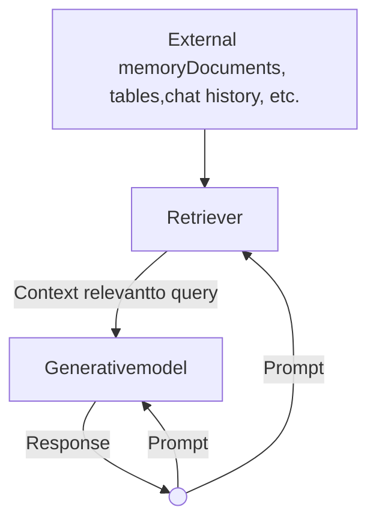
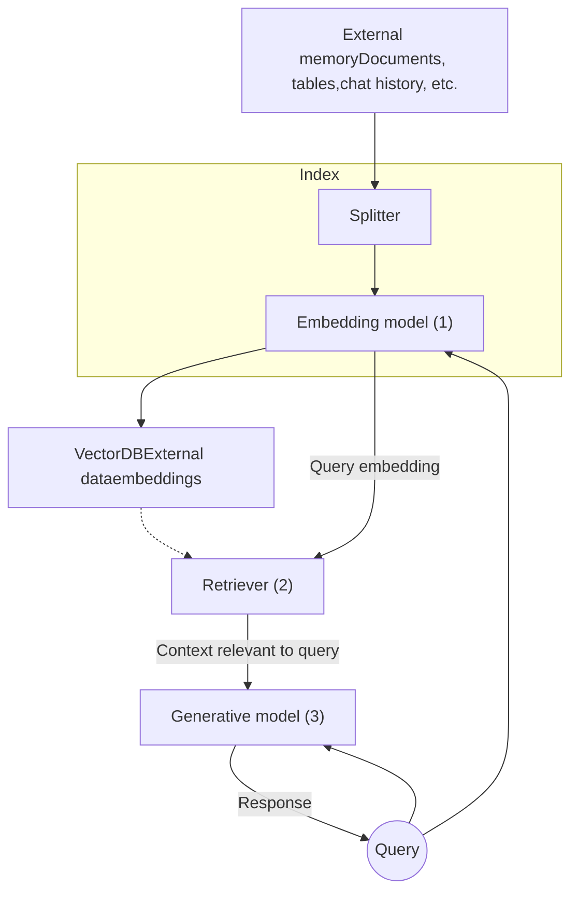
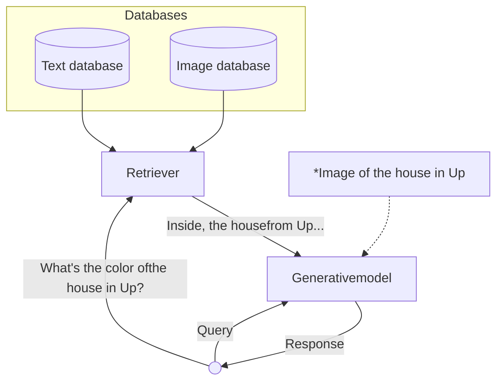

# CHAPTER 6 RAG and Agents

To solve a task, a model needs both the instructions on how to do it, and the neces‐ sary information to do so. Just like how a human is more likely to give a wrong answer when lacking information, AI models are more likely to make mistakes and hallucinate when they are missing context. For a given application, the model’s instructions are common to all queries, whereas context is specific to each query. The last chapter discussed how to write good instructions to the model. This chapter focuses on how to construct the relevant context for each query.

Two dominating patterns for context construction are RAG, or retrieval-augmented generation, and agents. The RAG pattern allows the model to retrieve relevant infor‐ mation from external data sources. The agentic pattern allows the model to use tools such as web search and news APIs to gather information.

While the RAG pattern is chiefly used for constructing context, the agentic pattern can do much more than that. External tools can help models address their shortcom‐ ings and expand their capabilities. Most importantly, they give models the ability to directly interact with the world, enabling them to automate many aspects of our lives.

Both RAG and agentic patterns are exciting because of the capabilities they bring to already powerful models. In a short amount of time, they’ve managed to capture the collective imagination, leading to incredible demos and products that convince many people that they are the future. This chapter will go into detail about each of these patterns, how they work, and what makes them so promising.

## RAG

RAG is a technique that enhances a model’s generation by retrieving the relevant information from external memory sources. An external memory source can be an internal database, a user’s previous chat sessions, or the internet.The *retrieve-then-generate* pattern was first introduced in “Reading Wikipedia to Answer Open-Domain Questions” (Chen et al., 2017). In this work, the system first retrieves five Wikipedia pages most relevant to a question, then a model<sup>1</sup> uses, or reads, the information from these pages to generate an answer, as visualized in Figure 6-1.



Figure 6-1. The retrieve-then-generate pattern. The model was referred to as the document reader.

The term retrieval-augmented generation was coined in “Retrieval-Augmented Generation for Knowledge-Intensive NLP Tasks” (Lewis et al., 2020). The paper proposed RAG as a solution for knowledge-intensive tasks where all the available knowledge can’t be input into the model directly. With RAG, only the information most relevant to the query, as determined by the retriever, is retrieved and input into the model. Lewis et al. found that having access to relevant information can help the model generate more detailed responses while reducing hallucinations.<sup>2</sup>

<sup>1</sup> The model used was a type of recurrent neural network known as LSTM (Long Short-Term Memory). LSTM was the dominant architecture of deep learning for natural language processing (NLP) before the transformer architecture took over in 2018.

<sup>2</sup> Around the same time, another paper, also from Facebook, “How Context Affects Language Models’ Factual Predictions” (Petroni et al., arXiv, May 2020), showed that augmenting a pre-trained language model with a retrieval system can dramatically improve the model’s performance on factual questions.For example, given the query “Can Acme’s fancy-printer-A300 print 100pps?”, the model will be able to respond better if it’s given the specifications of fancy-printer-A300.<sup>3</sup>

You can think of RAG as a technique to construct context specific to each query, instead of using the same context for all queries. This helps with managing user data, as it allows you to include data specific to a user only in queries related to this user.

Context construction for foundation models is equivalent to feature engineering for classical ML models. They serve the same purpose: giving the model the necessary information to process an input.

In the early days of foundation models, RAG emerged as one of the most common patterns. Its main purpose was to overcome the models’ context limitations. Many people think that a sufficiently long context will be the end of RAG. I don’t think so. First, no matter how long a model’s context length is, there will be applications that require context longer than that. After all, the amount of available data only grows over time. People generate and add new data but rarely delete data. Context length is expanding quickly, but not fast enough for the data needs of arbitrary applications.<sup>4</sup>

Second, a model that can process long context doesn’t necessarily use that context well, as discussed in “Context Length and Context Efficiency” on page 218. The longer the context, the more likely the model is to focus on the wrong part of the context. Every extra context token incurs extra cost and has the potential to add extra latency. RAG allows a model to use only the most relevant information for each query, reducing the number of input tokens while potentially increasing the model’s performance.

Efforts to expand context length are happening in parallel with efforts to make models use context more effectively. I wouldn’t be surprised if a model provider incorporates a retrieval-like or attention-like mechanism to help a model pick out the most salient parts of a context to use.

<sup>3</sup> Thanks to Chetan Tekur for the example.

<sup>4</sup> Parkinson’s Law is usually expressed as “Work expands so as to fill the time available for its completion.” I have a similar theory that an application’s context expands to fill the context limit supported by the model it uses.Crow logo Anthropic suggested that for Claude models, if “your knowledge base is smaller than 200,000 tokens (about 500 pages of material), you can just include the entire knowledge base in the prompt that you give the model, with no need for RAG or similar methods” (Anthropic, 2024). It’d be amazing if other model developers provide similar guidance for RAG versus long context for their models.

## RAG Architecture

A RAG system has two components: a retriever that retrieves information from external memory sources and a generator that generates a response based on the retrieved information. Figure 6-2 shows a high-level architecture of a RAG system.



Figure 6-2. A basic RAG architecture.

In the original RAG paper, Lewis et al. trained the retriever and the generative model together. In today’s RAG systems, these two components are often trained separately, and many teams build their RAG systems using off-the-shelf retrievers and models. However, finetuning the whole RAG system end-to-end can improve its performance significantly.

The success of a RAG system depends on the quality of its retriever. A retriever has two main functions: indexing and querying. Indexing involves processing data so that it can be quickly retrieved later. Sending a query to retrieve data relevant to it is called querying. How to index data depends on how you want to retrieve it later on.

Now that we’ve covered the primary components, let’s consider an example of how a RAG system works. For simplicity, let’s assume that the external memory is a database of documents, such as a company’s memos, contracts, and meeting notes. Adocument can be 10 tokens or 1 million tokens. Naively retrieving whole documents can cause your context to be arbitrarily long. To avoid this, you can split each document into more manageable chunks. Chunking strategies will be discussed later in this chapter. For now, let’s assume that all documents have been split into workable chunks. For each query, our goal is to retrieve the data chunks most relevant to this query. Minor post-processing is often needed to join the retrieved data chunks with the user prompt to generate the final prompt. This final prompt is then fed into the generative model.

> Crow icon In this chapter, I use the term “document” to refer to both “document” and “chunk”, because technically, a chunk of a document is also a document. I do this to keep this book’s terminologies consistent with classical NLP and information retrieval (IR) terminologies.

# Retrieval Algorithms

Retrieval isn’t unique to RAG. Information retrieval is a century-old idea.<sup>5</sup> It’s the backbone of search engines, recommender systems, log analytics, etc. Many retrieval algorithms developed for traditional retrieval systems can also be used for RAG. For instance, information retrieval is a fertile research area with a large supporting industry that can hardly be sufficiently covered within a few pages. Accordingly, this section will cover only the broad strokes. See this book’s GitHub repository for more in-depth resources on information retrieval.

> Crow icon Retrieval is typically limited to one database or system, whereas search involves retrieval across various systems. This chapter uses retrieval and search interchangeably.

At its core, retrieval works by ranking documents based on their relevance to a given query. Retrieval algorithms differ based on how relevance scores are computed. I’ll start with two common retrieval mechanisms: term-based retrieval and embedding-based retrieval.

<sup>5</sup> Information retrieval was described as early as the 1920s in Emanuel Goldberg’s patents for a “statistical machine” to search documents stored on films. See “The History of Information Retrieval Research” (Sanderson and Croft, *Proceedings of the IEEE*, 100: Special Centennial Issue, April 2012).# Sparse Versus Dense Retrieval

In the literature, you might encounter the division of retrieval algorithms into the following categories: sparse versus dense. This book, however, opted for term-based versus embedding-based categorization.

Sparse retrievers represent data using sparse vectors. A sparse vector is a vector where the majority of the values are 0. Term-based retrieval is considered sparse, as each term can be represented using a sparse one-hot vector, a vector that is 0 everywhere except one value of 1. The vector size is the length of the vocabulary. The value of 1 is in the index corresponding to the index of the term in the vocabulary.

If we have a simple dictionary, {“food”: 0, “banana”: 1, “slug”: 2}, then the one-hot vectors of “food”, “banana”, and “slug” are [1, 0, 0], [0, 1, 0], and [0, 0, 1]. respectively.

Dense retrievers represent data using dense vectors. A dense vector is a vector where the majority of the values aren’t 0. Embedding-based retrieval is typically considered dense, as embeddings are generally dense vectors. However, there are also sparse embeddings. For example, SPLADE (Sparse Lexical and Expansion) is a retrieval algorithm that works using sparse embeddings (Formal et al., 2021). It leverages embeddings generated by BERT but uses regularization to push most embedding values to 0. The sparsity makes embedding operations more efficient.

The sparse versus dense division causes SPLADE to be grouped together with term-based algorithms, even though SPLADE’s operations, strengths, and weaknesses are much more similar to those of dense embedding retrieval than those of term-based retrieval. Term-based versus embedding-based division avoids this miscategorization.

## Term-based retrieval

Given a query, the most straightforward way to find relevant documents is with keywords. Some people call this approach lexical retrieval. For example, given the query “AI engineering”, the model will retrieve all the documents that contain “AI engineering”. However, this approach has two problems:

* Many documents might contain the given term, and your model might not have sufficient context space to include all of them as context. A heuristic is to include the documents that contain the term the greatest number of times. The assumption is that the more a term appears in a document, the more relevant this document is to this term. The number of times a term appears in a document is called *term frequency* (TF).

* A prompt can be long and contain many terms. Some are more important than others. For example, the prompt “Easy-to-follow recipes for Vietnamese food to cook at home” contains nine terms: easy-to-follow, recipes, for, vietnamese, food,to, cook, at, home. You want to focus on more informative terms like *vietnamese* and *recipes*, not *for* and *at*. You need a way to identify important terms.

An intuition is that the more documents contain a term, the less informative this term is. "For" and "at" are likely to appear in most documents, hence, they are less informative. So a term's importance is inversely proportional to the number of documents it appears in. This metric is called *inverse document frequency* (IDF). To compute IDF for a term, count all the documents that contain this term, then divide the total number of documents by this count. If there are 10 documents and 5 of them contain a given term, then the IDF of this term is 10 / 5 = 2. The higher a term's IDF, the more important it is.

TF-IDF is an algorithm that combines these two metrics: term frequency (TF) and inverse document frequency (IDF). Mathematically, the TF-IDF score of document D for the query Q is computed as follows:

* Let $t_1, t_2, ..., t_q$ be the terms in the query Q.

* Given a term $t$, the term frequency of this term in the document $D$ is $f(t, D)$.

* Let $N$ be the total number of documents, and $C(t)$ be the number of documents that contain $t$. The IDF value of the term $t$ can be written as $IDF(t) = \log \frac{N}{C(t)}$.

* Naively, the TF-IDF score of a document $D$ with respect to $Q$ is defined as $\text{Score}(D, Q) = \sum_{i=1}^q \text{IDF}(t_i) \times f(t_i, D)$.

Two common term-based retrieval solutions are Elasticsearch and BM25. Elasticsearch (Shay Banon, 2010), built on top of Lucene, uses a data structure called an inverted index. It's a dictionary that maps from terms to documents that contain them. This dictionary allows for fast retrieval of documents given a term. The index might also store additional information such as the term frequency and the document count (how many documents contain this term), which are helpful for computing TF-IDF scores. Table 6-1 illustrates an inverted index.

Table 6-1. A simplified example of an inverted index.

<table>
  <thead>
    <tr>
        <th>Term</th>
        <th>Document count</th>
        <th>(Document index, term frequency) for all documents containing the term</th>
    </tr>
  </thead>
  <tbody>
    <tr>
        <td>banana</td>
        <td>2</td>
        <td>(10, 3), (5, 2)</td>
    </tr>
    <tr>
        <td>machine</td>
        <td>4</td>
        <td>(1, 5), (10, 1), (38, 9), (42, 5)</td>
    </tr>
    <tr>
        <td>learning</td>
        <td>3</td>
        <td>(1, 5), (38, 7), (42, 5)</td>
    </tr>
    <tr>
        <td>...</td>
        <td>...</td>
        <td>...</td>
    </tr>
  </tbody>
</table>

Okapi BM25, the 25th generation of the Best Matching algorithm, was developed by Robertson et al. in the 1980s. Its scorer is a modification of TF-IDF. Compared to naive TF-IDF, BM25 normalizes term frequency scores by document length. Longerdocuments are more likely to contain a given term and have higher term frequency values.<sup>6</sup>

BM25 and its variances (BM25+, BM25F) are still widely used in the industry and serve as formidable baselines to compare against modern, more sophisticated retrieval algorithms, such as embedding-based retrieval, discussed next.<sup>7</sup>

One process I glossed over is tokenization, the process of breaking a query into individual terms. The simplest method is to split the query into words, treating each word as a separate term. However, this can lead to multi-word terms being broken into individual words, losing their original meaning. For example, “hot dog” would be split into “hot” and “dog”. When this happens, neither retains the meaning of the original term. One way to mitigate this issue is to treat the most common n-grams as terms. If the bigram “hot dog” is common, it’ll be treated as a term.

Additionally, you might want to convert all characters to lowercase, remove punctuation, and eliminate stop words (like “the”, “and”, “is”, etc.). Term-based retrieval solutions often handle these automatically. Classical NLP packages, such as NLTK (Natural Language Toolkit), spaCy, and Stanford’s CoreNLP, also offer tokenization functionalities.

Chapter 4 discusses measuring the lexical similarity between two texts based on their n-gram overlap. Can we retrieve documents based on the extent of their n-gram overlap with the query? Yes, we can. This approach works best when the query and the documents are of similar lengths. If the documents are much longer than the query, the likelihood of them containing the query’s n-grams increases, leading to many documents having similarly high overlap scores. This makes it difficult to distinguish truly relevant documents from less relevant ones.

## Embedding-based retrieval

Term-based retrieval computes relevance at a lexical level rather than a semantic level. As mentioned in Chapter 3, the appearance of a text doesn’t necessarily capture its meaning. This can result in returning documents irrelevant to your intent. For example, querying “transformer architecture” might return documents about the electric device or the movie *Transformers*. On the other hand, embedding-based retrievers aim to rank documents based on how closely their meanings align with the query. This approach is also known as semantic retrieval.

<sup>6</sup> For those interested in learning more about BM25, I recommend this paper by the BM25 authors: “The Probabilistic Relevance Framework: BM25 and Beyond” (Robertson and Zaragoza, *Foundations and Trends in Information Retrieval* 3 No. 4, 2009)

<sup>7</sup> Aravind Srinivas, the CEO of Perplexity, tweeted that “Making a genuine improvement over BM25 or full-text search is hard”.With embedding-based retrieval, indexing has an extra function: converting the original data chunks into embeddings. The database where the generated embeddings are stored is called a *vector database*. Querying then consists of two steps, as shown in Figure 6-3:

1. Embedding model: convert the query into an embedding using the same embedding model used during indexing.

2. Retriever: fetch k data chunks whose embeddings are closest to the query embedding, as determined by the retriever. The number of data chunks to fetch, k, depends on the use case, the generative model, and the query.



Figure 6-3. A high-level view of how an embedding-based, or semantic, retriever works.

The embedding-based retrieval workflow shown here is simplified. Real-world semantic retrieval systems might contain other components, such as a reranker to rerank all retrieved candidates, and caches to reduce latency.<sup>8</sup>

With embedding-based retrieval, we again encounter embeddings, which are discussed in Chapter 3. As a reminder, an embedding is typically a vector that aims to preserve the important properties of the original data. An embedding-based retriever doesn't work if the embedding model is bad.

<sup>8</sup> A RAG retrieval workflow shares many similar steps with the traditional recommender system.Embedding-based retrieval also introduces a new component: vector databases. A vector database stores vectors. However, storing is the easy part of a vector database. The hard part is vector search. Given a query embedding, a vector database is responsible for finding vectors in the database close to the query and returning them. Vectors have to be indexed and stored in a way that makes vector search fast and efficient.

Like many other mechanisms that generative AI applications depend on, vector search isn't unique to generative AI. Vector search is common in any application that uses embeddings: search, recommendation, data organization, information retrieval, clustering, fraud detection, and more.

Vector search is typically framed as a nearest-neighbor search problem. For example, given a query, find the *k* nearest vectors. The naive solution is *k*-nearest neighbors (*k*-NN), which works as follows:

1. Compute the similarity scores between the query embedding and all vectors in the database, using metrics such as cosine similarity.

2. Rank all vectors by their similarity scores.

3. Return *k* vectors with the highest similarity scores.

This naive solution ensures that the results are precise, but it's computationally heavy and slow. It should be used only for small datasets.

For large datasets, vector search is typically done using an approximate nearest neighbor (ANN) algorithm. Due to the importance of vector search, many algorithms and libraries have been developed for it. Some popular vector search libraries are FAISS (Facebook AI Similarity Search) (Johnson et al., 2017), Google's ScaNN (Scalable Nearest Neighbors) (Sun et al., 2020), Spotify's Annoy (Bernhardsson, 2013), and Hnswlib (Hierarchical Navigable Small World) (Malkov and Yashunin, 2016).

Most application developers won't implement vector search themselves, so I'll give only a quick overview of different approaches. This overview might be helpful as you evaluate solutions.

In general, vector databases organize vectors into buckets, trees, or graphs. Vector search algorithms differ based on the heuristics they use to increase the likelihood that similar vectors are close to each other. Vectors can also be quantized (reduced precision) or made sparse. The idea is that quantized and sparse vectors are less computationally intensive to work with. For those wanting to learn more about vector search, Zilliz has an excellent series on it. Here are some significant vector search algorithms:LSH (locality-sensitive hashing) *(Indyk and Motwani, 1999)*
This is a powerful and versatile algorithm that works with more than just vectors. This involves hashing similar vectors into the same buckets to speed up similarity search, trading some accuracy for efficiency. It’s implemented in FAISS and Annoy.

HNSW (Hierarchical Navigable Small World) *(Malkov and Yashunin, 2016)*
HNSW constructs a multi-layer graph where nodes represent vectors, and edges connect similar vectors, allowing nearest-neighbor searches by traversing graph edges. Its implementation by the authors is open source, and it’s also implemented in FAISS and Milvus.

Product Quantization *(Jégou et al., 2011)*
This works by reducing each vector into a much simpler, lower-dimensional representation by decomposing each vector into multiple subvectors. The distances are then computed using the lower-dimensional representations, which are much faster to work with. Product quantization is a key component of FAISS and is supported by almost all popular vector search libraries.

IVF (inverted file index) *(Sivic and Zisserman, 2003)*
IVF uses K-means clustering to organize similar vectors into the same cluster. Depending on the number of vectors in the database, it’s typical to set the number of clusters so that, on average, there are 100 to 10,000 vectors in each cluster. During querying, IVF finds the cluster centroids closest to the query embedding, and the vectors in these clusters become candidate neighbors. Together with product quantization, IVF forms the backbone of FAISS.

Annoy (Approximate Nearest Neighbors Oh Yeah) *(Bernhardsson, 2013)*
Annoy is a tree-based approach. It builds multiple binary trees, where each tree splits the vectors into clusters using random criteria, such as randomly drawing a line and splitting the vectors into two branches using this line. During a search, it traverses these trees to gather candidate neighbors. Spotify has open sourced its implementation.

There are other algorithms, such as Microsoft’s SPTAG (Space Partition Tree And Graph), and FLANN (Fast Library for Approximate Nearest Neighbors).

Even though vector databases emerged as their own category with the rise of RAG, any database that can store vectors can be called a vector database. Many traditional databases have extended or will extend to support vector storage and vector search.## Comparing retrieval algorithms

Due to the long history of retrieval, its many mature solutions make both term-based and embedding-based retrieval relatively easy to start. Each approach has its pros and cons.

Term-based retrieval is generally much faster than embedding-based retrieval during both indexing and query. Term extraction is faster than embedding generation, and mapping from a term to the documents that contain it can be less computationally expensive than a nearest-neighbor search.

Term-based retrieval also works well out of the box. Solutions like Elasticsearch and BM25 have successfully powered many search and retrieval applications. However, its simplicity also means that it has fewer components you can tweak to improve its performance.

Embedding-based retrieval, on the other hand, can be significantly improved over time to outperform term-based retrieval. You can finetune the embedding model and the retriever, either separately, together, or in conjunction with the generative model. However, converting data into embeddings can obscure keywords, such as specific error codes, e.g., EADDRNOTAVAIL (99), or product names, making them harder to search later on. This limitation can be addressed by combining embedding-based retrieval with term-based retrieval, as discussed later in this chapter.

The quality of a retriever can be evaluated based on the quality of the data it retrieves. Two metrics often used by RAG evaluation frameworks are context precision and con‐ text recall, or precision and recall for short (context precision is also called context relevance):

## Context precision

Out of all the documents retrieved, what percentage is relevant to the query?

## Context recall

Out of all the documents that are relevant to the query, what percentage is retrieved?

To compute these metrics, you curate an evaluation set with a list of test queries and a set of documents. For each test query, you annotate each test document to be rele‐ vant or not relevant. The annotation can be done either by humans or AI judges. You then compute the precision and recall score of the retriever on this evaluation set.

In production, some RAG frameworks only support context precision, not context recall To compute context recall for a given query, you need to annotate the relevance of all documents in your database to that query. Context precision is simpler to com‐ pute. You only need to compare the retrieved documents to the query, which can be done by an AI judge.If you care about the ranking of the retrieved documents, for example, more relevant documents should be ranked first, you can use metrics such as NDCG (normalized discounted cumulative gain), MAP (Mean Average Precision), and MRR (Mean Reciprocal Rank).

For semantic retrieval, you need to also evaluate the quality of your embeddings. As discussed in Chapter 3, embeddings can be evaluated independently—they are considered good if more-similar documents have closer embeddings. Embeddings can also be evaluated by how well they work for specific tasks. The MTEB benchmark (Muennighoff et al., 2023) evaluates embeddings for a broad range of tasks including retrievals, classification, and clustering.

The quality of a retriever should also be evaluated in the context of the whole RAG system. Ultimately, a retriever is good if it helps the system generate high-quality answers. Evaluating outputs of generative models is discussed in Chapters 3 and 4.

Whether the performance promise of a semantic retrieval system is worth pursuing depends on how much you prioritize cost and latency, particularly during the querying phase. Since much of RAG latency comes from output generation, especially for long outputs, the added latency by query embedding generation and vector search *might be minimal compared to the total RAG latency*. Even so, the added latency still can impact user experience.

Another concern is cost. Generating embeddings costs money. This is especially an issue if your data changes frequently and requires frequent embedding regeneration. Imagine having to generate embeddings for 100 million documents every day! Depending on what vector databases you use, vector storage and vector search queries can be expensive, too. It’s not uncommon to see a company’s vector database spending be one-fifth or even half of their spending on model APIs.

Table 6-2 shows a side-by-side comparison of term-based retrieval and embedding-based retrieval.

Table 6-2. Term-based retrieval and semantic retrieval by speed, performance, and cost.

<table>
  <thead>
    <tr>
        <th> </th>
        <th>Term-based retrieval</th>
        <th>Embedding-based retrieval</th>
    </tr>
  </thead>
  <tbody>
    <tr>
        <td>Querying speed</td>
        <td>Much faster than embedding-based retrieval</td>
        <td>Query embedding generation and vector search can be slow</td>
    </tr>
    <tr>
        <td>Performance</td>
        <td>Typically strong performance out of the box, but hard to improve<br/>Can retrieve wrong documents due to term ambiguity</td>
        <td>Can outperform term-based retrieval with finetuning<br/>Allows for the use of more natural queries, as it focuses on semantics instead of terms</td>
    </tr>
    <tr>
        <td>Cost</td>
        <td>Much cheaper than embedding-based retrieval</td>
        <td>Embedding, vector storage, and vector search solutions can be expensive</td>
    </tr>
  </tbody>
</table>With retrieval systems, you can make certain trade-offs between indexing and query‐ ing. The more detailed the index is, the more accurate the retrieval process will be, but the indexing process will be slower and more memory-consuming. Imagine building an index of potential customers. Adding more details (e.g., name, company, email, phone, interests) makes it easier to find relevant people but takes longer to build and requires more storage.

In general, a detailed index like HNSW provides high accuracy and fast query times but requires significant time and memory to build. In contrast, a simpler index like LSH is quicker and less memory-intensive to create, but it results in slower and less accurate queries.

The ANN-Benchmarks website compares different ANN algorithms on multiple datasets using four main metrics, taking into account the trade-offs between indexing and querying. These include the following:

Recall

The fraction of the nearest neighbors found by the algorithm.

Query per second (QPS)

The number of queries the algorithm can handle per second. This is crucial for high-traffic applications.

Build time

The time required to build the index. This metric is especially important if you need to frequently update your index (e.g., because your data changes).

Index size

The size of the index created by the algorithm, which is crucial for assessing its scalability and storage requirements.

Additionally, BEIR (Benchmarking IR) (Thakur et al., 2021) is an evaluation harness for retrieval. It supports retrieval systems across 14 common retrieval benchmarks.

To summarize, the quality of a RAG system should be evaluated both component by component and end to end. To do this, you should do the following things:

1. Evaluate the retrieval quality.

2. Evaluate the final RAG outputs.

3. Evaluate the embeddings (for embedding-based retrieval).

## Combining retrieval algorithms

Given the distinct advantages of different retrieval algorithms, a production retrieval system typically combines several approaches. Combining term-based retrieval and embedding-based retrieval is called hybrid search.Different algorithms can be used in sequence. First, a cheap, less precise retriever, such as a term-based system, fetches candidates. Then, a more precise but more expensive mechanism, such as k-nearest neighbors, finds the best of these candidates. This second step is also called *reranking*.

For example, given the term “transformer”, you can fetch all documents that contain the word transformer, regardless of whether they are about the electric device, the neural architecture, or the movie. Then you use vector search to find among these documents those that are actually related to your transformer query. As another example, consider the query “Who’s responsible for the most sales to X?” First, you might fetch all documents associated with X using the keyword X. Then, you use vector search to retrieve the context associated with “Who’s responsible for the most sales?”

Different algorithms can also be used in parallel as an ensemble. Remember that a retriever works by ranking documents by their relevance scores to the query. You can use multiple retrievers to fetch candidates at the same time, then combine these different rankings together to generate a final ranking.

An algorithm for combining different rankings is called reciprocal rank fusion (RRF) (Cormack et al., 2009). It assigns each document a score based on its ranking by a retriever. Intuitively, if it ranks first, its score is 1/1 = 1. If it ranks second, its score is ½ = 0.5. The higher it ranks, the higher its score.

A document’s final score is the sum of its scores with respect to all retrievers. If a document is ranked first by one retriever and second by another retriever, its score is 1 + 0.5 = 1.5. This example is an oversimplification of RRF, but it shows the basics. The actual formula for a document D is more complicated, as follows:

$$ Score(D) = \sum_{i=1}^{n} \frac{1}{k + r_i(D)} $$

* *n* is the number of ranked lists; each rank list is produced by a retriever.

* *r<sub>i</sub>(D)* is the rank of the document by the retriever *i*.

* *k* is a constant to avoid division by zero and to control the influence of lower-ranked documents. A typical value for *k* is 60.

# Retrieval Optimization

Depending on the task, certain tactics can increase the chance of relevant documents being fetched. Four tactics discussed here are chunking strategy, reranking, query rewriting, and contextual retrieval.## Chunking strategy

How your data should be indexed depends on how you intend to retrieve it later. The last section covered different retrieval algorithms and their respective indexing strate‐ gies. There, the discussion was based on the assumption that documents have already been split into manageable chunks. In this section, I’ll cover different chunking strategies. This is an important consideration because the chunking strategy you use can significantly impact the performance of your retrieval system.

The simplest strategy is to chunk documents into chunks of equal length based on a certain unit. Common units are characters, words, sentences, and paragraphs. For example, you can split each document into chunks of 2,048 characters or 512 words. You can also split each document so that each chunk can contain a fixed number of sentences (such as 20 sentences) or paragraphs (such as each paragraph is its own chunk).

You can also split documents recursively using increasingly smaller units until each chunk fits within your maximum chunk size. For example, you can start by splitting a document into sections. If a section is too long, split it into paragraphs. If a paragraph is still too long, split it into sentences. This reduces the chance of related texts being arbitrarily broken off.

Specific documents might also support creative chunking strategies. For example, there are splitters developed especially for different programming languages. Q&A documents can be split by question or answer pair, where each pair makes up a chunk. Chinese texts might need to be split differently from English texts.

When a document is split into chunks without overlap, the chunks might be cut off in the middle of important context, leading to the loss of critical information. Con‐ sider the text “I left my wife a note”. If it’s split into “I left my wife” and “a note”, neither of these two chunks conveys the key information of the original text. Over‐ lapping ensures that important boundary information is included in at least one chunk. If you set the chunk size to be 2,048 characters, you can perhaps set the over‐ lapping size to be 20 characters.

The chunk size shouldn’t exceed the maximum context length of the generative model. For the embedding-based approach, the chunk size also shouldn’t exceed the embedding model’s context limit.

You can also chunk documents using tokens, determined by the generative model’s tokenizer, as a unit. Let’s say that you want to use Llama 3 as your generative model. You then first tokenize documents using Llama 3’s tokenizer. You can then split documents into chunks using tokens as the boundaries. Chunking by tokens makes it easier to work with downstream models. However, the downside of this approach is that if you switch to another generative model with a different tokenizer, you’d need to reindex your data.Regardless of which strategy you choose, chunk sizes matter. A smaller chunk size allows for more diverse information. Smaller chunks mean that you can fit more chunks into the model’s context. If you halve the chunk size, you can fit twice as many chunks. More chunks can provide a model with a wider range of information, which can enable the model to produce a better answer.

Small chunk sizes, however, can cause the loss of important information. Imagine a document that contains important information about the topic X throughout the document, but X is only mentioned in the first half. If you split this document into two chunks, the second half of the document might not be retrieved, and the model won’t be able to use its information.

Smaller chunk sizes can also increase computational overhead. This is especially an issue for embedding-based retrieval. Halving the chunk size means that you have twice as many chunks to index and twice as many embedding vectors to generate and store. Your vector search space will be twice as big, which can reduce the query speed.

There is no universal best chunk size or overlap size. You have to experiment to find what works best for you.

## Reranking

The initial document rankings generated by the retriever can be further reranked to be more accurate. Reranking is especially useful when you need to reduce the number of retrieved documents, either to fit them into your model’s context or to reduce the number of input tokens.

One common pattern for reranking is discussed in “Combining retrieval algorithms” on page 266. A cheap but less precise retriever fetches candidates, then a more precise but more expensive mechanism reranks these candidates.

Documents can also be reranked based on time, giving higher weight to more recent data. This is useful for time-sensitive applications such as news aggregation, chat with your emails (e.g., a chatbot that can answer questions about your emails), or stock market analysis.

Context reranking differs from traditional search reranking in that the exact position of items is less critical. In search, the rank (e.g., first or fifth) is crucial. In context reranking, the order of documents still matters because it affects how well a model can process them. Models might better understand documents at the beginning and end of the context, as discussed in “Context Length and Context Efficiency” on page 218. However, as long as a document is included, the impact of its order is less signif‐ icant compared to search ranking.# Query rewriting

*Query rewriting* is also known as query reformulation, query normalization, and sometimes query expansion. Consider the following conversation:

> *User*: When was the last time John Doe bought something from us?
> *AI*: John last bought a Fruity Fedora hat from us two weeks ago, on January 3, 2030.
> *User*: How about Emily Doe?

The last question, "How about Emily Doe?", is ambiguous without context. If you use this query verbatim to retrieve documents, you'll likely get irrelevant results. You need to rewrite this query to reflect what the user is actually asking. The new query should make sense on its own. In this case, the query should be rewritten to "When was the last time Emily Doe bought something from us?"

While I put query rewriting in "RAG" on page 253, query rewriting isn't unique to RAG. In traditional search engines, query rewriting is often done using heuristics. In AI applications, query rewriting can also be done using other AI models, using a prompt similar to "Given the following conversation, rewrite the last user input to reflect what the user is actually asking". Figure 6-4 shows how ChatGPT rewrote the query using this prompt.

Screenshot of a ChatGPT interface showing a query rewriting prompt and response.

Figure 6-4. You can use other generative models to rewrite queries.

Query rewriting can get complicated, especially if you need to do identity resolution or incorporate other knowledge. For example, if the user asks "How about his wife?" you will first need to query your database to find out who his wife is. If you don't have this information, the rewriting model should acknowledge that this query isn't solvable instead of hallucinating a name, leading to a wrong answer.# Contextual retrieval

The idea behind contextual retrieval is to augment each chunk with relevant context to make it easier to retrieve the relevant chunks. A simple technique is to augment a chunk with metadata like tags and keywords. For ecommerce, a product can be augmented by its description and reviews. Images and videos can be queried by their titles or captions.

The metadata may also include entities automatically extracted from the chunk. If your document contains specific terms like the error code EADDRNOTAVAIL (99), adding them to the document’s metadata allows the system to retrieve it by that keyword, even after the document has been converted into embeddings.

You can also augment each chunk with the questions it can answer. For customer support, you can augment each article with related questions. For example, the article on how to reset your password can be augmented with queries like “How to reset password?”, “I forgot my password”, “I can’t log in”, or even “Help, I can’t find my account”.<sup>9</sup>

If a document is split into multiple chunks, some chunks might lack the necessary context to help the retriever understand what the chunk is about. To avoid this, you can augment each chunk with the context from the original document, such as the original document’s title and summary. Anthropic used AI models to generate a short context, usually 50-100 tokens, that explains the chunk and its relationship to the original document. Here’s the prompt Anthropic used for this purpose (Anthropic, 2024):

```
<document>
{{WHOLE_DOCUMENT}}
</document>

Here is the chunk we want to situate within the whole document:

<chunk>
{{CHUNK_CONTENT}}
</chunk>
```

Please give a short succinct context to situate this chunk within the overall document for the purposes of improving search retrieval of the chunk. Answer only with the succinct context and nothing else.

<sup>9</sup> Some teams have told me that their retrieval systems work best when the data is organized in a question-and-answer format.The generated context for each chunk is prepended to each chunk, and the augmented chunk is then indexed by the retrieval algorithm. Figure 6-5 visualizes the process that Anthropic follows.

```mermaid
graph TD
    subgraph PREPROCESSING_new [PREPROCESSING (new)]
        Corpus --> Chunk1
        Corpus --> Chunk2
        Corpus --> ChunkX[...]
        
        Chunk1 --> Prompt[Run prompt forevery chunk tosituate it withinthe document]
        Chunk2 --> Prompt
        ChunkX --> Prompt
        
        Prompt --> Context1[Context 1 + Chunk 1]
        Prompt --> Context2[Context 2 + Chunk 2]
        Prompt --> ContextX[Context X + Chunk X]
        
        Note[For every prompt, Clauderesponds with 50-100 tokens ofcontext, which is then prependedto the corresponding chunk] -.-> Context1
    end

    Context1 --> Embedding[Embeddingmodel]
    Context2 --> Embedding
    ContextX --> Embedding
    
    Context1 --> TFIDF[TF-IDF]
    Context2 --> TFIDF
    ContextX --> TFIDF
    
    Embedding -- Embeddings --> VectorDB[(Vectordatabase)]
    TFIDF -- TF-IDFvectors --> TFIDFIndex[TF-IDFindex]
    
    Query((Query)) --> VectorDB
    Query --> TFIDFIndex
```

Figure 6-5. Anthropic augments each chunk with a short context that situates this chunk within the original document, making it easier for the retriever to find the relevant chunks given a query. Image from “Introducing Contextual Retrieval” (Anthropic, 2024).

## Evaluating Retrieval Solutions

Here are some key factors to keep in mind when evaluating a retrieval solution:

* What retrieval mechanisms does it support? Does it support hybrid search?

* If it’s a vector database, what embedding models and vector search algorithms does it support?

* How scalable is it, both in terms of data storage and query traffic? Does it work for your traffic patterns?

* How long does it take to index your data? How much data can you process (such as add/delete) in bulk at once?

* What’s its query latency for different retrieval algorithms?

* If it’s a managed solution, what’s its pricing structure? Is it based on the document/vector volume or on the query volume?

This list doesn’t include the functionalities typically associated with enterprise solutions such as access control, compliance, data plane and control plane separation, etc.# RAG Beyond Texts

The last section discussed text-based RAG systems where the external data sources are text documents. However, external data sources can also be multimodal and tabular data.

## Multimodal RAG

If your generator is multimodal, its contexts might be augmented not only with text documents but also with images, videos, audio, etc., from external sources. I’ll use images in the examples to keep the writing concise, but you can replace images with any other modality. Given a query, the retriever fetches both texts and images relevant to it. For example, given “What’s the color of the house in the Pixar movie Up?” the retriever can fetch a picture of the house in *Up* to help the model answer, as shown in Figure 6-6.



Figure 6-6. Multimodal RAG can augment a query with both text and images. (\*The real image from *Up* is not used, for copyright reasons.)

If the images have metadata—such as titles, tags, and captions—they can be retrieved using the metadata. For example, an image is retrieved if its caption is considered relevant to the query.

If you want to retrieve images based on their content, you’ll need to have a way to compare images to queries. If queries are texts, you’ll need a multimodal embedding model that can generate embeddings for both images and texts. Let’s say you use CLIP (Radford et al., 2021) as the multimodal embedding model. The retriever works as follows:1. Generate CLIP embeddings for all your data, both texts and images, and store them in a vector database.

2. Given a query, generate its CLIP embedding.

3. Query in the vector database for all images and texts whose embeddings are close to the query embedding.

## RAG with tabular data

Most applications work not only with unstructured data like texts and images but also with tabular data. Many queries might need information from data tables to answer. The workflow for augmenting a context using tabular data is significantly different from the classic RAG workflow.

Imagine you work for an ecommerce site called Kitty Vogue that specializes in cat fashion. This store has an order table named Sales, as shown in Table 6-3.

Table 6-3. An example of an order table, Sales, for the imaginary ecommerce site Kitty Vogue.

<table>
  <thead>
    <tr>
        <th>Order ID</th>
        <th>Timestamp</th>
        <th>Product ID</th>
        <th>Product</th>
        <th>Unit price ($)</th>
        <th>Units</th>
        <th>Total</th>
    </tr>
  </thead>
  <tbody>
    <tr>
        <td>1</td>
        <td>...</td>
        <td>2044</td>
        <td>Meow Mix Seasoning</td>
        <td>10.99</td>
        <td>1</td>
        <td>10.99</td>
    </tr>
    <tr>
        <td>2</td>
        <td>...</td>
        <td>3492</td>
        <td>Purr &amp; Shake</td>
        <td>25</td>
        <td>2</td>
        <td>50</td>
    </tr>
    <tr>
        <td>3</td>
        <td>...</td>
        <td>2045</td>
        <td>Fruity Fedora</td>
        <td>18</td>
        <td>1</td>
        <td>18</td>
    </tr>
    <tr>
        <td>...</td>
        <td>...</td>
        <td>...</td>
        <td>...</td>
        <td>...</td>
        <td>...</td>
        <td>...</td>
    </tr>
  </tbody>
</table>

To generate a response to the question "How many units of Fruity Fedora were sold in the last 7 days?", your system needs to query this table for all orders involving Fruity Fedora and sum the number of units across all orders. Assume that this table can be queried using SQL. The SQL query might look like this:

```sql
SELECT SUM(units) AS total_units_sold
FROM Sales
WHERE product_name = 'Fruity Fedora'
AND timestamp >= DATE_SUB(CURDATE(), INTERVAL 7 DAY);
```

The workflow is as follows, visualized in Figure 6-7. To run this workflow, your system must have the ability to generate and execute the SQL query:

1. Text-to-SQL: based on the user query and the provided table schemas, determine what SQL query is needed. Text-to-SQL is an example of semantic parsing, as discussed in Chapter 2.

2. SQL execution: execute the SQL query.

3. Generation: generate a response based on the SQL result and the original user query.